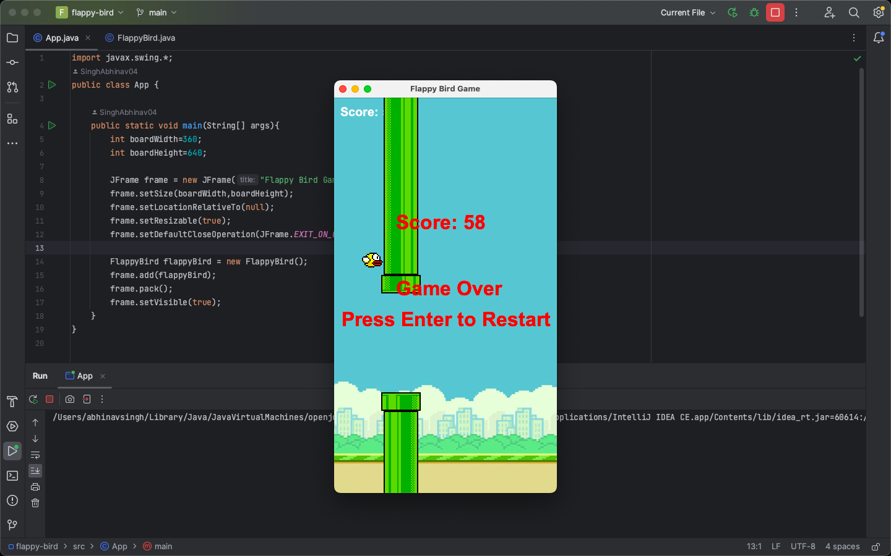

# Flappy Bird
Description
Flappy Bird is a classic arcade game where the player controls a bird trying to navigate through pipes by tapping the screen. This implementation is created using Java and the Swing framework.
Features
Basic Gameplay: Control the bird to fly between pipes.
Scoring System: Earn points for successfully navigating between pipes.
Pause/Resume: Pause the game using the spacebar and resume from the same position.
Game Over: The game ends when the bird hits a pipe or the ground.




---

## Tech Stack

| Category   | Technology        |
|-----------|--------------------|
| Language  | Java (JDK 8+)      |
| GUI       | Java Swing (AWT)   |
| Build     | No build tool (plain Java) |

---

## Features

- **Core gameplay** – Control the bird through gaps between pipes; score increases per pipe passed.
- **Scoring** – Live score and **high score** (persists until game restart).
- **Pause / Resume** – Pause with Space, resume from the same state.
- **Game over** – Collision with pipes or boundaries; restart with Enter.
- **Simple physics** – Gravity and flap (up/down keys) for movement.

---

## Controls

| Key        | Action                    |
|-----------|----------------------------|
| **Enter** | Start game / Restart       |
| **Up**    | Flap (move up)             |
| **Down**  | Move down                  |
| **Space** | Pause / Resume             |

---

## How to Run

### Prerequisites

- **JDK 8 or higher** installed and `java`, `javac` on PATH.

### Compile and run

From the **project root** (the folder that contains `src`):

```bash
# Compile
javac -d out src/App.java src/FlappyBird.java

# Run (from project root)
java -cp out App
```

**If you keep classes inside `src`:**

```bash
javac src/App.java src/FlappyBird.java
java -cp src App
```

### Using an IDE

- **IntelliJ IDEA / Eclipse:** Open the project folder, set `src` as source root, then run `App.java`.
- **VS Code:** Use the existing `launch.json` or run `App` from the Run and Debug view.

---

## Project Structure

```
Flappy-Bird-JAVA-main/
├── src/
│   ├── App.java           # Entry point, creates JFrame and game panel
│   ├── FlappyBird.java    # Game logic, rendering, input, collision
│   ├── flappybird.png     # Bird sprite
│   ├── flappybirdbg.png   # Background
│   ├── toppipe.png        # Top pipe
│   └── bottompipe.png     # Bottom pipe
├── README.md
└── FlappyBird.png         # Screenshot for README
```

---

## Concepts Demonstrated (for interviews)

- **OOP** – Classes for game panel, bird, and pipes; encapsulation of state and behavior.
- **Event-driven programming** – `KeyListener`, `ActionListener`, Swing `Timer` for input and game loop.
- **Collision detection** – Axis-aligned bounding boxes using `Rectangle.intersects()`.
- **2D rendering** – Custom painting in `paintComponent()` with `Graphics` and image drawing.
- **Game loop** – Fixed timestep (e.g. 60 FPS) via `Timer` for consistent movement and spawning.

---

## Author

Developed as a portfolio project for campus placement and Java practice.
